# Android Nexus 📱💻

Android Nexus is a friendly desktop application that lets you manage and control your Android phone directly from your computer! 

Think of it like a control center for your phone: you can browse files, manage apps, see notifications in real-time, take screenshots, and even mirror your phone's screen on your monitor.

---

## 🌟 What Can It Do?

*   **📊 Phone Health Dashboard**: See your phone's manufacturer, battery level, storage space, and system specifications at a glance.
*   **📁 File Manager**: Browse files and folders on your phone, download them to your computer, or upload files from your PC to your phone.
*   **🤖 App Control Center**: View all your installed apps, launch them, uninstall them, back up their APK files, or install new apps from your computer.
*   **🔔 Notification Sync**: See incoming phone notifications on your computer screen instantly. You can even dismiss them without picking up your phone!
*   **🖥️ Screen Mirroring & Controls**: Mirror your phone screen to your PC monitor using `scrcpy`, and use physical control buttons (like Volume Up, Volume Down, Mute, and Power) from the desktop app.

---

## 🛠️ How It Works (For Beginners)

When you plug your phone into your computer, they talk to each other using a helper tool called **ADB (Android Debug Bridge)**. 

Here is how Android Nexus is organized under the hood to keep things fast and organized:

```mermaid
graph TD
    subgraph PresentationLayer ["1. User Interface Layer"]
        FXML[FXML Layouts] --> Controller[View Controllers]
    end

    subgraph UiServiceLayer ["2. Asynchronous Worker Layer"]
        Controller --> UiService[UI Services]
        UiService --> Executor[UiThreadExecutor]
    end

    subgraph BackendFacadeLayer ["3. Command Center Facade"]
        UiService --> BackendController[Backend Controllers]
    end

    subgraph ServiceParserLayer ["4. Logic & Parser Layer"]
        BackendController --> Service[Services]
        Service --> Parser[Parsers]
    end

    subgraph InfrastructureLayer ["5. Execution Layer"]
        Service --> CmdExec[CommandExecutor]
        CmdExec --> Proc[ProcessBuilder]
    end

    subgraph OnDeviceExecution ["6. On Your Phone"]
        Proc --> ADB[ADB Daemon]
        ADB --> Android[Android System]
    end

    style PresentationLayer fill:#2d3748,stroke:#4a5568,stroke-width:2px;
    style UiServiceLayer fill:#1a202c,stroke:#2d3748,stroke-width:2px;
    style BackendFacadeLayer fill:#2b6cb0,stroke:#3182ce,stroke-width:2px;
    style ServiceParserLayer fill:#2c5282,stroke:#2b6cb0,stroke-width:2px;
    style InfrastructureLayer fill:#276749,stroke:#2f855a,stroke-width:2px;
    style OnDeviceExecution fill:#744210,stroke:#975a16,stroke-width:2px;
```



1.  **User Interface Layer**: What you see on your screen (buttons, lists, themes).
2.  **Asynchronous Worker Layer**: Runs heavy phone operations in the background so the app never freezes or lags.
3.  **Command Center Facade**: Validates your inputs before sending them to the phone.
4.  **Logic & Parser Layer**: Formats the messy text returned by the phone into clean, structured data lists.
5.  **Execution Layer**: Spawns OS processes and runs ADB commands on your computer.
6.  **On Your Phone**: The commands execute on your phone and send back responses.

For a deeper dive into the technical details, check out the [Architecture Documentation](docs/Architecture.md).

---

## 🚀 Getting Started (Simple Setup)

Setting up Android Nexus is easy. Follow these simple steps:

### Step 1: Enable USB Debugging on Your Phone
To let your computer talk to your phone:
1. Open your phone's **Settings**.
2. Go to **About Phone** and tap **Build Number** 7 times until it says *"You are now a developer!"*.
3. Go back to the main Settings menu, find **Developer Options**, and toggle **USB Debugging** to ON.

### Step 2: Plug in Your Phone
Connect your phone to your computer with a USB cable. If your phone asks to *"Allow USB Debugging?"*, tap **Allow**.

### Step 3: Run the Application
Make sure you have **Java 21** and **Maven** installed, then run these commands in your terminal:

```bash
# 1. Compile the project
mvn clean compile

# 2. Run the application
mvn javafx:run
```

---

## 🗺️ Project Roadmap
- [x] **Module 5**: Remote File Manager.
- [x] **Module 6**: APK Application Manager.
- [x] **Module 7**: Notification Status Monitor.
- [x] **Module 8**: Dynamic themed Desktop UI.
- [ ] **Module 9**: Local Ollama AI System Assistant.
- [ ] **Module 10**: Recent Files & Bookmark Favorites features.
