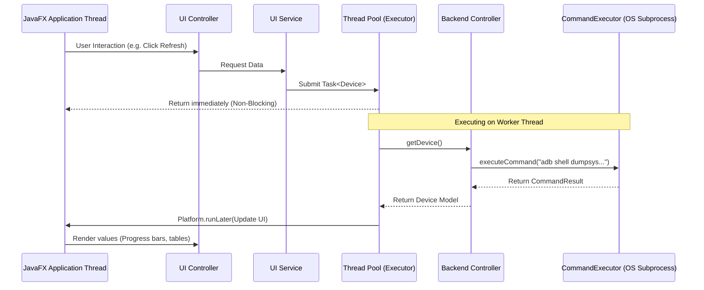

# Android Nexus — Architecture Documentation

This document describes the architectural design, architectural boundaries, and threading/concurrency model of Android Nexus.

---

## 1. Multi-Tier Layered Architecture

Android Nexus is designed with strict layering boundaries to decouple the presentation layer (JavaFX Desktop UI, CLI) from low-level operating system process execution (ADB shell).

```mermaid
graph TD
    subgraph Presentation Layer
        FXML[FXML Layouts] --> Controller[View Controllers]
    end

    subgraph UI Service Layer
        Controller --> UiService[UI Services]
        UiService --> Executor[UiThreadExecutor]
    end

    subgraph Backend Facade Layer
        UiService --> BackendController[Backend Controllers]
    end

    subgraph Service & Parser Layer
        BackendController --> Service[Services]
        Service --> Parser[Parsers]
    end

    subgraph Infrastructure Layer
        Service --> CmdExec[CommandExecutor]
        CmdExec --> Proc[ProcessBuilder]
    end

    subgraph On-Device Execution
        Proc --> ADB[ADB Daemon]
        ADB --> Android[Android System]
    end

    style Presentation Layer fill:#2d3748,stroke:#4a5568,stroke-width:2px;
    style UI Service Layer fill:#1a202c,stroke:#2d3748,stroke-width:2px;
    style Backend Facade Layer fill:#2b6cb0,stroke:#3182ce,stroke-width:2px;
    style Service & Parser Layer fill:#2c5282,stroke:#2b6cb0,stroke-width:2px;
    style Infrastructure Layer fill:#276749,stroke:#2f855a,stroke-width:2px;
    style On-Device Execution fill:#744210,stroke:#975a16,stroke-width:2px;
```

---

## 2. Core Architectural Components

### Presentation Layer
- **FXML Layouts**: Static layouts containing UI structural definitions (VBox, SplitPane, TableView).
- **View Controllers**: Stateless/stateful event handlers that manage UI states, format bounds, and bind listeners.

### UI Service Layer
- **UI Services**: Orchestrates asynchronous data operations. It translates view calls into background tasks.
- **UiThreadExecutor**: Centralized executor utilizing daemon threads to schedule asynchronous tasks, preventing blocking on the JavaFX Application thread.

### Backend Facade Layer
- **Backend Controllers**: Single-point entry facades (`DeviceController`, `FileController`, `ApplicationController`, `NotificationController`) that perform parameter validation before executing service methods.

### Service & Parser Layer
- **Services**: Orchestrates business logic, parses parameters, maps file inputs, and determines capability parameters.
- **Parsers**: Pure, stateless data transformers that parse unstructured console outputs (e.g. from dumpsys, pm, ls) into structured Java models.

### Infrastructure Layer
- **CommandExecutor**: Spawns OS processes, handles stdout/stderr streams concurrently in daemon threads to prevent deadlocks, and enforces timeouts.

---

## 3. Concurrency & Threading Model

To maintain a responsive UI, **no ADB command or file I/O operations are permitted on the JavaFX Application Thread**.

### Asynchronous Execution Sequence


---

## 4. Boundary & Dependency Rules

1. **Downward Dependency Direction**: Dependencies flow strictly downwards. Presentation depends on UI Service, which depends on Backend Controllers, which depends on Services, which depends on ADB infrastructure. Lower layers must NEVER reference upper layers.
2. **Stateless Parsers**: Parsers must be utility classes containing only pure static methods. They must not hold state or run ADB subprocesses.
3. **No raw process execution in Services**: All process executions must occur via the `CommandExecutor` boundary.
